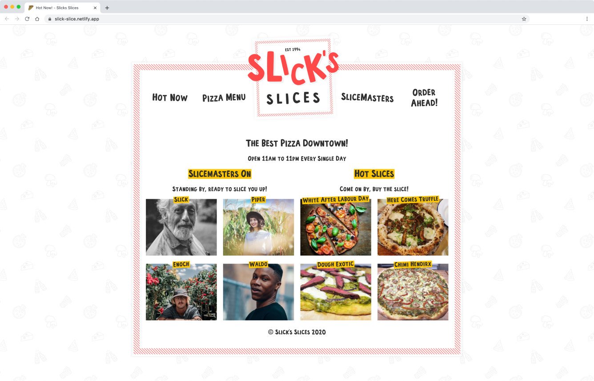

# Slicks-Slices

Multi-page website using Gatsby and Sanity.io - headless CMS, deployed on Netlify.

## Installation

    $ git clone git@github.com:sonickonic/slicks-slices.git
    $ cd slicks-slices
    $ npm install

## Run the app

    $ npm start
